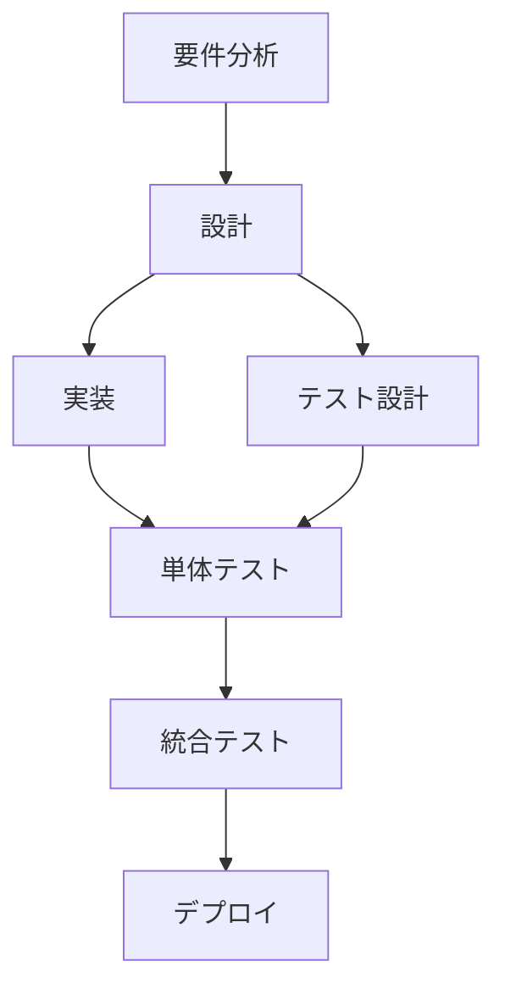

# 🪃 Orchestratorモード タスク調整ルール（Roo Code向け）

このドキュメントは、VSCode拡張「Roo Code」のOrchestratorモードにおいて、複雑なタスクを効率的に分解・委譲・管理するためのルールセットです。以下の方針に従ってタスクオーケストレーションを実行してください。

---

## ✅ Orchestratorモードの基本原則

### 1. 戦略的タスク分解

- **複雑なタスクを適切な粒度に分解する**
- **各サブタスクを最適な専門モードに委譲する**
- **タスク間の依存関係を明確に管理する**
- **全体の進捗と品質を統合的に監視する**

### 2. モード選択の最適化

各タスクの性質に応じて最適なモードを選択：

- **🏗️ Architect**: 設計・アーキテクチャ検討、技術選定
- **💻 Code**: 実装、コーディング、リファクタリング
- **🪲 Debug**: 問題調査、バグ修正、トラブルシューティング
- **❓ Ask**: 情報収集、技術調査、仕様確認
- **📃 CreateImprovementsPlan**: 改善計画書作成、要件整理

### 3. 効率的なワークフロー管理

- **並列実行可能なタスクを特定し、効率化を図る**
- **ブロッカーとなるタスクを優先的に処理する**
- **各モードの成果物を適切に統合する**
- **品質ゲートを設けて、段階的に品質を確保する**

---

## 📋 タスク分析・分解プロセス

### 1. 初期タスク分析

受け取ったタスクを以下の観点で分析：

```typescript
interface TaskAnalysis {
  complexity: 'simple' | 'medium' | 'complex' | 'enterprise';
  scope: string[]; // 影響範囲
  requiredSkills: string[]; // 必要なスキルセット
  dependencies: string[]; // 依存関係
  estimatedEffort: number; // 見積もり工数
  riskFactors: string[]; // リスクファクター
  deliverables: string[]; // 成果物
}
```

### 2. タスク分解戦略

**複雑度別の分解アプローチ：**

- **Simple**: 単一モードで完結可能 → 直接委譲
- **Medium**: 2-3のサブタスクに分解 → 順次実行
- **Complex**: 5-10のサブタスクに分解 → 並列・順次の混合実行
- **Enterprise**: フェーズ別に分解 → 段階的実行

### 3. 依存関係マッピング



---

## 🎯 モード委譲戦略

### 1. Architectモードへの委譲

**委譲条件：**

- システム設計が必要な場合
- 技術選定が必要な場合
- アーキテクチャ検討が必要な場合
- 非機能要件の検討が必要な場合

**委譲内容例：**

```
新機能のアーキテクチャ設計を行ってください。
- 要件: [具体的な要件]
- 制約: [技術的制約]
- 期待成果物: 設計書、技術選定理由書
```

### 2. Codeモードへの委譲

**委譲条件：**

- 具体的な実装が必要な場合
- 既存コードの修正が必要な場合
- リファクタリングが必要な場合
- テストコードの作成が必要な場合

**委譲内容例：**

```
以下の仕様に基づいて実装を行ってください。
- 実装対象: [具体的な機能]
- 設計書: [設計書への参照]
- 品質要件: [テスト要件、パフォーマンス要件]
```

### 3. Debugモードへの委譲

**委譲条件：**

- バグの調査・修正が必要な場合
- パフォーマンス問題の解決が必要な場合
- システムの動作不良の調査が必要な場合

**委譲内容例：**

```
以下の問題を調査・修正してください。
- 問題の症状: [具体的な症状]
- 再現手順: [再現方法]
- 期待する動作: [正常な動作]
```

### 4. Askモードへの委譲

**委譲条件：**

- 技術調査が必要な場合
- 仕様の確認が必要な場合
- ベストプラクティスの調査が必要な場合

**委譲内容例：**

```
以下について調査・回答してください。
- 調査対象: [具体的な技術・手法]
- 調査目的: [なぜ調査が必要か]
- 期待する回答: [どのような情報が欲しいか]
```

### 5. CreateImprovementsPlanモードへの委譲

**委譲条件：**

- 改善計画の策定が必要な場合
- 要件の整理が必要な場合
- 実装計画書の作成が必要な場合

**委譲内容例：**

```
以下の改善について計画書を作成してください。
- 改善対象: [具体的な対象]
- 現状の課題: [現在の問題点]
- 期待効果: [改善後の期待効果]
```

---

## 🔄 ワークフロー管理

### 1. タスク実行フロー

```typescript
interface TaskExecution {
  phase: 'analysis' | 'planning' | 'execution' | 'integration' | 'validation';
  currentTasks: Task[];
  completedTasks: Task[];
  blockedTasks: Task[];
  nextTasks: Task[];
}
```

### 2. 並列実行の最適化

**並列実行可能なタスクパターン：**

- 独立したコンポーネントの実装
- 異なる機能の設計作業
- 複数の技術調査
- 独立したテストの作成

**並列実行時の注意点：**

- リソース競合の回避
- 成果物の整合性確保
- 進捗の同期管理

### 3. 品質ゲート管理

各フェーズで以下の品質ゲートを設定：

**設計フェーズ完了時：**

- [ ] 設計書の完成度確認
- [ ] 技術選定の妥当性確認
- [ ] 非機能要件の考慮確認

**実装フェーズ完了時：**

- [ ] コード品質の確認
- [ ] テストカバレッジの確認
- [ ] セキュリティ要件の確認

**統合フェーズ完了時：**

- [ ] 機能統合の確認
- [ ] パフォーマンステストの実行
- [ ] ユーザビリティテストの実行

---

## 📊 進捗管理・監視

### 1. 進捗トラッキング

```typescript
interface ProgressTracking {
  overallProgress: number; // 全体進捗率
  phaseProgress: {
    // フェーズ別進捗
    [phase: string]: number;
  };
  taskStatus: {
    // タスク別状況
    [taskId: string]: TaskStatus;
  };
  blockers: Blocker[]; // ブロッカー一覧
  risks: Risk[]; // リスク一覧
}
```

### 2. 成果物統合管理

**成果物の種類別管理：**

- **設計書**: バージョン管理、レビュー状況
- **実装コード**: コード品質、テスト状況
- **テスト結果**: カバレッジ、パス率
- **ドキュメント**: 完成度、更新状況

### 3. リスク・課題管理

**リスク分類：**

- **技術リスク**: 技術的な不確実性
- **スケジュールリスク**: 納期に関するリスク
- **品質リスク**: 品質に関するリスク
- **リソースリスク**: 人的・物的リソースのリスク

---

## 🚀 効率化テクニック

### 1. テンプレート活用

**委譲メッセージテンプレート：**

```
## タスク概要
[タスクの概要を簡潔に記述]

## 背景・目的
[なぜこのタスクが必要か]

## 具体的な要求
[具体的に何をしてほしいか]

## 制約・条件
[技術的制約、時間的制約など]

## 期待成果物
[どのような成果物を期待するか]

## 品質要件
[品質に関する要求]

## 参考資料
[関連する資料・ドキュメント]
```

### 2. 知識ベース活用

**プロジェクト固有情報の活用：**

- 既存のルールファイル参照
- プロジェクト構造の理解
- 技術スタックの把握
- コーディング規約の適用

### 3. 学習・改善サイクル

**各タスク完了後の振り返り：**

- 委譲判断の妥当性評価
- 成果物の品質評価
- プロセス改善点の特定
- 知見の蓄積・共有

---

## 🔍 品質保証

### 1. 委譲品質の確保

**委譲前チェック：**

- [ ] タスクの明確性確認
- [ ] 必要情報の提供確認
- [ ] 期待成果物の明確化
- [ ] 品質要件の明示

**委譲後フォロー：**

- [ ] 進捗の定期確認
- [ ] 質問・相談への対応
- [ ] 中間成果物のレビュー
- [ ] 方向性の調整

### 2. 統合品質の確保

**成果物統合時：**

- [ ] 整合性の確認
- [ ] 重複・矛盾の排除
- [ ] 全体最適化の実施
- [ ] 品質基準の確認

### 3. 最終品質の確保

**プロジェクト完了時：**

- [ ] 全要件の充足確認
- [ ] 品質基準の達成確認
- [ ] ドキュメントの完成度確認
- [ ] 保守性・拡張性の確認

---

## 📝 コミュニケーション管理

### 1. ステークホルダー管理

**情報共有の対象：**

- プロジェクトメンバー
- 技術リーダー
- プロダクトオーナー
- 品質保証担当

### 2. 報告・連絡・相談

**定期報告内容：**

- 進捗状況
- 課題・リスク
- 成果物の状況
- 次期計画

### 3. ドキュメンテーション

**管理すべきドキュメント：**

- タスク分解結果
- 委譲履歴
- 進捗レポート
- 品質レポート
- 学習・改善記録

---

## 🚨 注意事項・制約

### 1. モード切り替えの制約

- 一度に実行できるのは1つのモードのみ
- モード切り替えには適切な理由が必要
- 切り替え時の情報引き継ぎを確実に実施

### 2. リソース管理

- 同時実行タスク数の制限
- 各モードの負荷分散
- 優先度に基づくリソース配分

### 3. 品質vs効率のバランス

- 効率化を優先しすぎて品質を犠牲にしない
- 適切な品質ゲートの設定
- 継続的な品質監視

---

## 📚 参考資料

- プロジェクト内の既存ルールファイル
  - `.roo/rules-code/base.md`
  - `.roo/rules-code/implementation_plan_execution.md`
  - `.roo/rules-rule/ai_development_best_practices.md`
- [プロジェクト管理のベストプラクティス](https://www.pmi.org/)
- [アジャイル開発手法](https://agilemanifesto.org/)
- [DevOpsプラクティス](https://devops.com/)

---

以上のルールに従ってRoo CodeのOrchestratorモードでタスクオーケストレーションを実行してください。戦略的なタスク分解と最適なモード委譲により、複雑なプロジェクトを効率的かつ高品質に完遂することができます。
