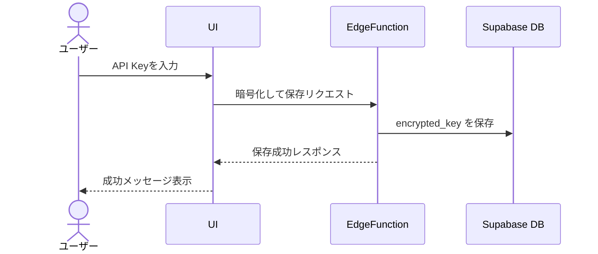
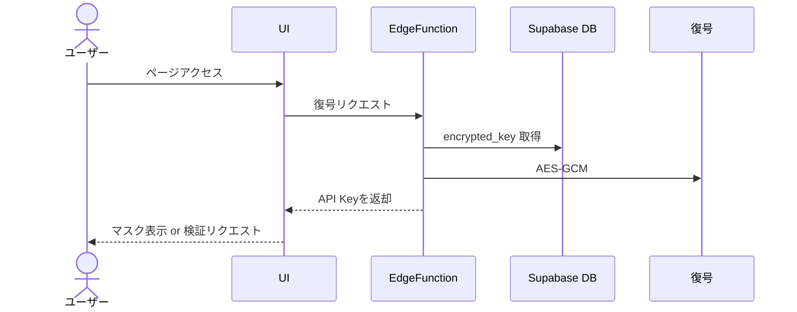
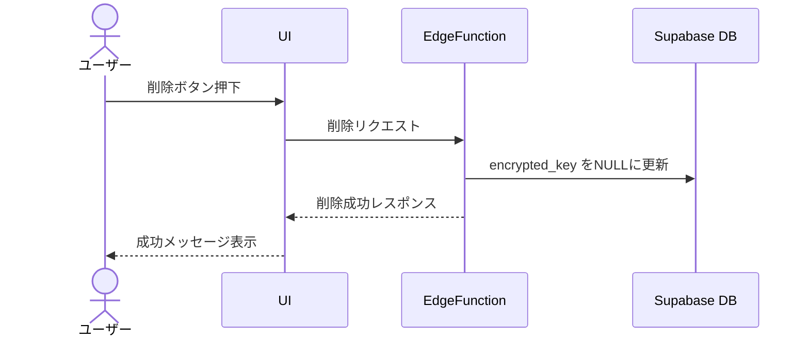

# 🔑 Promptsmith - OpenAI API設定機能 設計書

## 1. 機能概要

OpenAI API設定機能は、ユーザーが自身のOpenAI API Keyを登録・管理するための機能です。ユーザーはこのキーを通じてAIプロンプト実行機能を使用できます。本番環境ではキーをサーバー側で暗号化して保存し、セキュリティを担保します。

### 主要機能

- API Keyの登録と暗号化保存（Edge Functionを利用）
- API Keyの復号取得（認可されたユーザーに限定）
- API Keyの削除
- API Keyの有効性検証（OpenAI API経由）

## 2. 技術仕様

| 項目               | 仕様                                               |
| :----------------- | :------------------------------------------------- |
| 保存場所           | Supabaseのuser_settingsテーブル（encrypted_key列） |
| 暗号化方式         | AES-GCMによる暗号化（Edge Functionで実施）         |
| 復号化             | Edge Function上で環境変数の秘密鍵を使用            |
| 通信方式           | fetch APIでEdge Functionを呼び出し                 |
| エラーハンドリング | 失敗時はトーストやUI上にエラーメッセージを表示     |

## 3. UI設計

### 3.1 API設定ページ `/settings/api`

#### コンポーネント構成

- SettingsApiPage
  - PageHeader
  - ApiKeyForm
    - FormInput (type="password")
    - Button (保存)
    - Button (削除)
  - ApiKeyValidationStatus

#### 画面レイアウト

```
+-----------------------------------------------+
| Promptsmith                            🌙 👤 |
+-----------------------------------------------+
| 📝 プロンプト | ⚙️ API設定                        |
+-----------------------------------------------+
| ⚙️ OpenAI API設定                            |
|                                               |
| API Keyを入力してください                     |
| +-------------------------------------------+ |
| | ●●●●●●●●●●●●●●●●●●●●●●●●●●●● | 👁️ | |
| +-------------------------------------------+ |
|                                               |
| [ 保存 ]                [ 削除 ]              |
|                                               |
| ✅ API Keyは有効です                          |
+-----------------------------------------------+
```

## 4. データフロー

### 4.1 API Key保存フロー



### 4.2 API Key取得フロー



### 4.3 API Key削除フロー



## 5. セキュリティ設計

- 暗号鍵は .env 経由でVercelまたはAmplify環境変数に定義（例：OPENAI_ENCRYPTION_SECRET）
- Edge Functionのみが復号可能なスコープ
- ユーザーの認証（Supabase Auth）を通じて、自分の鍵のみアクセス可能
- クライアント側に復号済みのキーは保持しない設計も検討可

## 6. 拡張性

- 複数プロファイル（API Key複数登録）対応
- モデル設定、トークン制限などのカスタム設定保存
- 使用量やエラー履歴の統計表示

## 7. テスト観点

### 単体テスト

- Edge Function：保存・取得・削除・復号処理
- composable：状態管理、API呼び出し処理

### E2Eテスト

- API設定画面における保存→検証→削除のフロー
- 無効キーの登録エラー表示
