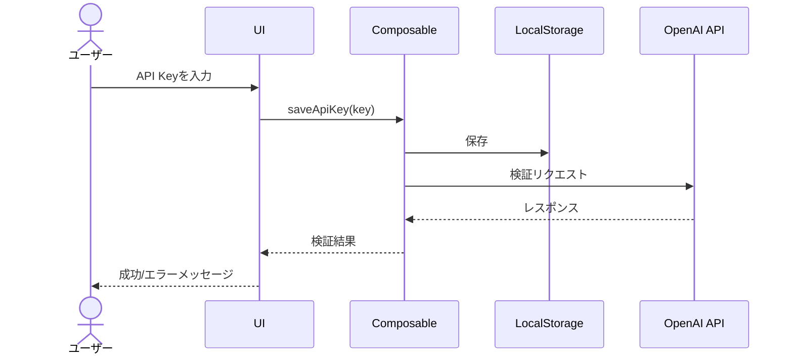
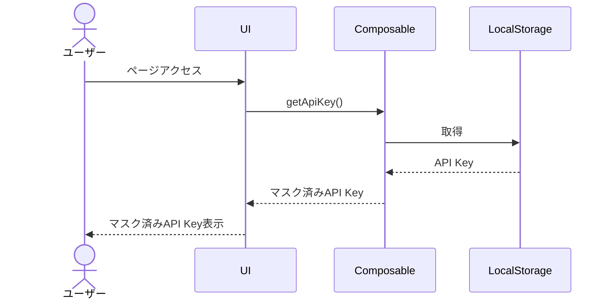
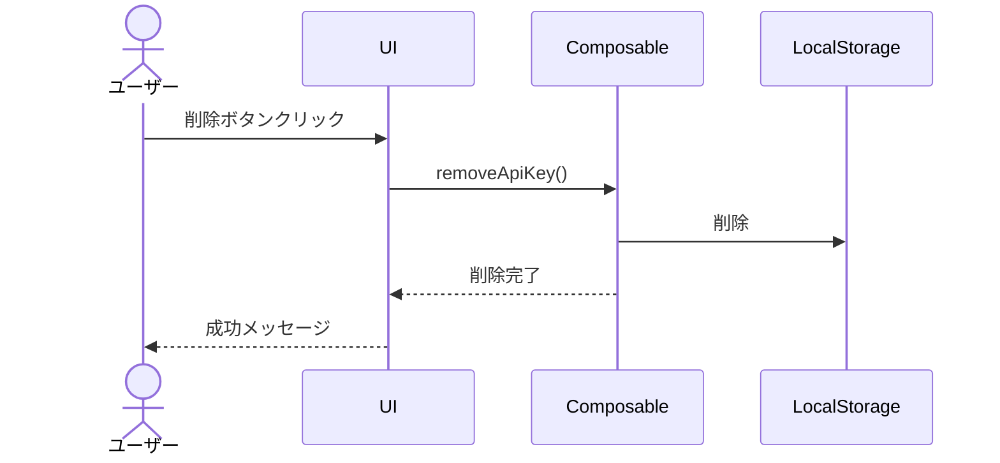

# OpenAI API設定機能 設計書

## 1. 機能概要

OpenAI API設定機能は、ユーザーが自身のOpenAI API Keyを登録・管理するための機能です。この機能により、ユーザーは自分のAPI Keyを使用してAIプロンプトを実行できるようになります。

### 主要機能

- API Keyの登録・保存
- API Keyの表示（マスキング処理あり）
- API Keyの削除
- API Keyの有効性検証

## 2. 技術仕様

| 項目               | 仕様                                   |
| :----------------- | :------------------------------------- |
| 保存場所           | localStorage（サーバーには保存しない） |
| 保存キー           | `promptsmith_openai_api_key`           |
| 暗号化             | 簡易暗号化（AES-GCM）を検討            |
| 通信方法           | fetch APIによる直接通信                |
| エラーハンドリング | API Key無効時のエラー表示              |

## 3. UI設計

### 3.1 API設定ページ

API設定ページは、ナビゲーションメニューから「API設定」をクリックすることでアクセスできます。

```
/settings/api
```

#### コンポーネント構成

```
SettingsApiPage
├── PageHeader
├── ApiKeyForm
│   ├── FormInput (type="password")
│   ├── Button (保存)
│   └── Button (削除)
└── ApiKeyValidationStatus
```

#### 画面レイアウト

```
+-----------------------------------------------+
| Promptsmith                            🌙 👤 |
+-----------------------------------------------+
| 📝 プロンプト | 🏃 実行 | ⚙️ API設定        |
+-----------------------------------------------+
| ⚙️ OpenAI API設定                            |
|                                               |
| API Keyを入力してください                     |
| +-------------------------------------------+ |
| | ●●●●●●●●●●●●●●●●●●●●●●●●●●●● | 👁️ | |
| +-------------------------------------------+ |
|                                               |
| [ 保存 ]                [ 削除 ]              |
|                                               |
| ✅ API Keyは有効です                          |
| （または ❌ API Keyが無効です）               |
|                                               |
+-----------------------------------------------+
```

### 3.2 API Key入力フォーム

- パスワードタイプの入力フィールド
- 表示/非表示切り替えアイコン
- バリデーション（空文字チェック、フォーマットチェック）

### 3.3 API Key有効性検証

- API Keyの有効性を確認するためのテストリクエスト
- 成功/失敗のステータス表示
- エラーメッセージの表示（失敗時）

## 4. データフロー

### 4.1 API Key保存フロー



### 4.2 API Key取得フロー



### 4.3 API Key削除フロー



## 5. コンポーネント設計

### 5.1 ApiKeyForm.vue

```vue
<template>
  <div class="space-y-4">
    <FormInput
      v-model="apiKey"
      label="OpenAI API Key"
      type="password"
      placeholder="sk-..."
      :error="error"
      :show-password-toggle="true"
    />

    <div class="flex space-x-4">
      <Button @click="saveApiKey" :disabled="!isValidFormat">保存</Button>
      <Button @click="removeApiKey" variant="outline" :disabled="!hasStoredKey">削除</Button>
    </div>

    <div v-if="validationStatus" :class="statusClass">
      {{ validationMessage }}
    </div>
  </div>
</template>

<script setup lang="ts">
import { ref, computed, onMounted } from 'vue';
import { useToast } from '~/composables/useToast';

const apiKey = ref('');
const error = ref('');
const validationStatus = ref<'valid' | 'invalid' | null>(null);
const hasStoredKey = ref(false);
const { showToast } = useToast();

// API Keyのフォーマット検証（sk-で始まる文字列）
const isValidFormat = computed(() => {
  return apiKey.value.startsWith('sk-') && apiKey.value.length > 3;
});

// ステータスに応じたクラス
const statusClass = computed(() => {
  return validationStatus.value === 'valid'
    ? 'text-green-500 dark:text-green-400'
    : 'text-red-500 dark:text-red-400';
});

// ステータスメッセージ
const validationMessage = computed(() => {
  return validationStatus.value === 'valid' ? 'API Keyは有効です' : 'API Keyが無効です';
});

// API Keyの保存と検証
async function saveApiKey() {
  if (!isValidFormat.value) {
    error.value = '有効なAPI Keyを入力してください';
    return;
  }

  try {
    // LocalStorageに保存
    localStorage.setItem('promptsmith_openai_api_key', apiKey.value);

    // API Keyの有効性を検証
    const isValid = await validateApiKey(apiKey.value);

    if (isValid) {
      validationStatus.value = 'valid';
      showToast('API Keyを保存しました', 'success');
      hasStoredKey.value = true;
      error.value = '';
    } else {
      validationStatus.value = 'invalid';
      showToast('API Keyが無効です', 'error');
    }
  } catch (err) {
    validationStatus.value = 'invalid';
    showToast('API Keyの検証中にエラーが発生しました', 'error');
  }
}

// API Keyの削除
function removeApiKey() {
  localStorage.removeItem('promptsmith_openai_api_key');
  apiKey.value = '';
  validationStatus.value = null;
  hasStoredKey.value = false;
  showToast('API Keyを削除しました', 'success');
}

// API Keyの有効性検証
async function validateApiKey(key: string): Promise<boolean> {
  try {
    const response = await fetch('https://api.openai.com/v1/models', {
      method: 'GET',
      headers: {
        Authorization: `Bearer ${key}`,
        'Content-Type': 'application/json',
      },
    });

    return response.status === 200;
  } catch (err) {
    console.error('API Key検証エラー:', err);
    return false;
  }
}

// 初期化時に保存済みのAPI Keyがあるか確認
onMounted(() => {
  const storedKey = localStorage.getItem('promptsmith_openai_api_key');
  if (storedKey) {
    apiKey.value = storedKey;
    hasStoredKey.value = true;
    // マスク表示用に実際の値は隠す処理も検討
  }
});
</script>
```

### 5.2 useOpenAiApi.ts Composable

```typescript
import { ref } from 'vue';

export function useOpenAiApi() {
  const apiKey = ref<string | null>(null);
  const isValid = ref<boolean | null>(null);
  const isLoading = ref(false);
  const error = ref<string | null>(null);

  // API Keyの取得
  function getApiKey(): string | null {
    if (apiKey.value) return apiKey.value;

    const storedKey = localStorage.getItem('promptsmith_openai_api_key');
    apiKey.value = storedKey;
    return storedKey;
  }

  // API Keyの保存
  function saveApiKey(key: string): void {
    localStorage.setItem('promptsmith_openai_api_key', key);
    apiKey.value = key;
  }

  // API Keyの削除
  function removeApiKey(): void {
    localStorage.removeItem('promptsmith_openai_api_key');
    apiKey.value = null;
    isValid.value = null;
  }

  // API Keyの有効性検証
  async function validateApiKey(key?: string): Promise<boolean> {
    const keyToValidate = key || getApiKey();
    if (!keyToValidate) return false;

    isLoading.value = true;
    error.value = null;

    try {
      const response = await fetch('https://api.openai.com/v1/models', {
        method: 'GET',
        headers: {
          Authorization: `Bearer ${keyToValidate}`,
          'Content-Type': 'application/json',
        },
      });

      isValid.value = response.status === 200;
      return isValid.value;
    } catch (err) {
      error.value = err instanceof Error ? err.message : '不明なエラーが発生しました';
      isValid.value = false;
      return false;
    } finally {
      isLoading.value = false;
    }
  }

  // OpenAI APIへのリクエスト送信
  async function sendRequest(endpoint: string, data: any) {
    const key = getApiKey();
    if (!key) {
      throw new Error('API Keyが設定されていません');
    }

    isLoading.value = true;
    error.value = null;

    try {
      const response = await fetch(`https://api.openai.com/v1/${endpoint}`, {
        method: 'POST',
        headers: {
          Authorization: `Bearer ${key}`,
          'Content-Type': 'application/json',
        },
        body: JSON.stringify(data),
      });

      if (!response.ok) {
        const errorData = await response.json();
        throw new Error(errorData.error?.message || 'APIリクエストに失敗しました');
      }

      return await response.json();
    } catch (err) {
      error.value = err instanceof Error ? err.message : '不明なエラーが発生しました';
      throw err;
    } finally {
      isLoading.value = false;
    }
  }

  return {
    apiKey,
    isValid,
    isLoading,
    error,
    getApiKey,
    saveApiKey,
    removeApiKey,
    validateApiKey,
    sendRequest,
  };
}
```

## 6. ページ設計

### 6.1 pages/settings/api.vue

```vue
<template>
  <div>
    <PageHeader title="OpenAI API設定" />

    <div class="max-w-2xl mx-auto mt-6 p-6 bg-white dark:bg-gray-800 rounded-lg shadow">
      <p class="mb-6 text-gray-700 dark:text-gray-300">
        OpenAI APIを利用するためのAPI Keyを設定してください。 API
        Keyは端末のlocalStorageに保存され、サーバーには送信されません。
      </p>

      <ApiKeyForm />

      <div class="mt-8 p-4 bg-gray-100 dark:bg-gray-700 rounded text-sm">
        <h3 class="font-medium mb-2">API Keyについて</h3>
        <p class="mb-2">
          API KeyはOpenAIのウェブサイトから取得できます。
          <a
            href="https://platform.openai.com/api-keys"
            target="_blank"
            class="text-blue-600 dark:text-blue-400 hover:underline"
          >
            OpenAI API Keys
          </a>
        </p>
        <p>
          料金やクレジットについては
          <a
            href="https://platform.openai.com/account/billing/overview"
            target="_blank"
            class="text-blue-600 dark:text-blue-400 hover:underline"
          >
            OpenAI Billing
          </a>
          をご確認ください。
        </p>
      </div>
    </div>
  </div>
</template>

<script setup lang="ts">
// コンポーネントのインポート
// ApiKeyFormコンポーネントは別途実装
</script>
```

## 7. セキュリティ考慮事項

### 7.1 API Keyの保護

- API Keyはサーバーに送信せず、クライアントサイドのlocalStorageにのみ保存
- 画面表示時はマスキング処理を行い、全文表示は任意選択制
- セッション終了時の自動削除オプションの検討

### 7.2 通信セキュリティ

- HTTPS通信のみを許可
- OpenAI APIとの通信は直接クライアントから行う
- 最小限の権限スコープでのAPI利用

## 8. テスト方針

### 8.1 単体テスト

- `useOpenAiApi` composableのテスト
  - API Key保存・取得・削除機能
  - バリデーション機能
  - エラーハンドリング

### 8.2 コンポーネントテスト

- `ApiKeyForm.vue`のテスト
  - 入力検証
  - 保存・削除ボタンの動作
  - エラー表示

### 8.3 E2Eテスト

- API Key設定フロー
  - 無効なAPI Keyの検証
  - 有効なAPI Keyの保存と検証
  - API Key削除

## 9. 今後の拡張性

- 複数のAPI Keyプロファイル管理
- API使用量・コスト表示
- モデル別設定（温度、トークン数など）
- 組織IDの設定サポート
